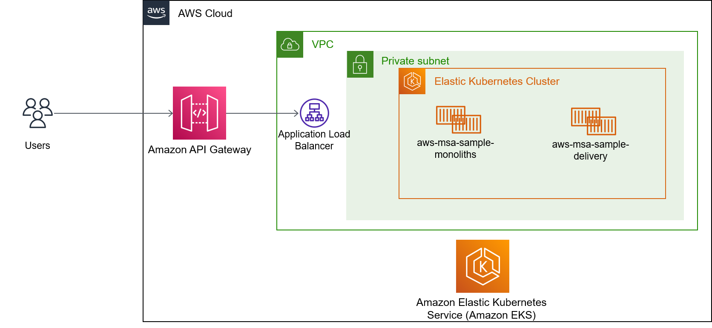
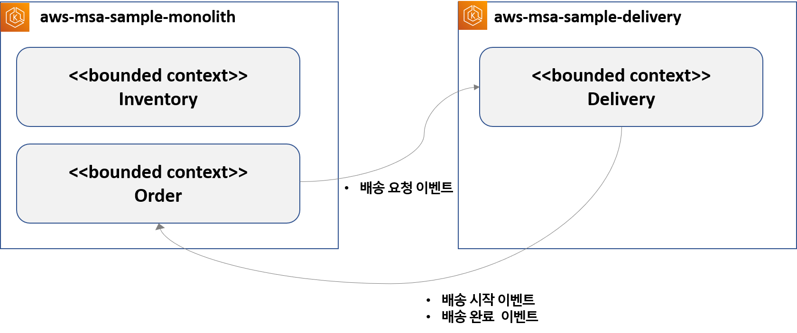

# Background 
- 토니는 카카오톡을 통해 지인들로 부터 복숭아를 주문 받습니다. 주문내용에는 받는사람의 주소와 연락처 정보, 몇 상자의 복숭아가 배송되는지에 대한 정보가
포함되어 있습니다. 그리고 토니는 이 배송정보를 별도의 엑셀파일에 저장하고 관리하고 있습니다. 그리고 이 엑셀파일을 하루 단위로 인쇄하여 
시골에서 복숭아 과수원을 하고 있는 투투에게 전달합니다.

- 주문 정보를 전달한 주문자는 토니에게 금액을 전달 합니다. 토니는 복숭아 배송지 당 상자수를 계산하여 주문자에게 입금해야하는 금액을 정보를 알려줍니다.
그리고 주문자는 금액을 확인하여 토니에게 카카오페이를 통해 입금을 하게 됩니다. 입금이 완료되면 해당 정보를 엑셀파일에 "입금완료" 엑셀파일에 업데이트 합니다.

- 투투는 복숭아 과수원을 하고 있습니다. 복숭아는 매일 출하 할 수 있는 수량이 정해져 있으며, 이 정보는 투투가 알고 있습니다. 투투는 토니로 부터 
엑셀파일을 전달 받으면 배송정보를 확인합니다. 전체 배송 목록 중에서 어디까지 배송할 수 있는지 확인하고 토니에게 알려 줍니다. 그 다음 투투는 복숭아
과수원에 올라가서 복숭아를 수확하고 포장을하고 택배 업체를 통해 복숭아를 배송합니다. 포장된 복숭아는 2박스당 5,000 원의 배송비가 발생하고 배송이
완료된 주문에 대해서 토니에게 알려줍니다.
 
- 배송이 시작되었는 정보를 받으면, 토니는 주문자에게 배송이 시작되었다고 카카오톡으로 알려줍니다. 그리고 이후에 배송이 완료 되었는지 주문자한 사람에게
연락하여 확인하고 있습니다. 이 때 항상 모든 정보는 엑셀파일에 업데이트 하여 어디까지 배송이 완료되었는지 관리합니다.

- 주문자 또한 배송이 시작되었는지, 복숭아를 수확했는지, 포장이 되고 있는지 등등을 궁금해 할따마다 토니에게 항상 연락을 해야만 알 수가 있습니다.

# Working Backwards
## Problems 
- 새로운 주문이 들어올 때 마다 매번 다시 인쇄하여 전달해야 하므로 번거롭다.
- 하루에 정해준 수확량이 있는데 그 이상 주문이 들어 올때도 있다.
- 주문자는 배송이 시작되었는지, 포장 중인 등등을 바로 바로 확인할 수가 없다.
- 주문자는 카카오톡을 통해서 주문을 할수 있고, 토니가 답장을 안하면 주문을 할 수가 없다.

## Solutions (EPICs 도출)
- 주문자로서 복숭아 배송에 대한 신뢰를 얻기 위해 내가 주문한 복숭아가 준비가 되고 있는지 실시간으로 보고 싶다.
- 투투는 오늘의 주문정보를 알기 위해 주문정보를 실시간으로 확인 할 수 있다.
 
# Event Storming Workshop
## Business Narrative
## Process Design
## Software Design

# aws-msa-monolith-sample
이 프로젝트는 엔터프라이즈 환경에서 AWS MSK 를 기반의 메시징 처리 예제 코드를 포함하고 있습니다. 

## 목표
- 마이크로서비스 간에 메시징에 대한 이해
- Dead Letter 처리 모니터링 및 관리 방안

## 어떤 기능을 제공하는 애플리케이션인가요?
|번호|기능|API|
|------|---|---|
|1|주문요청|POST /order|
|2|결제완료|POST /pay|
|3|배송조회|GET /shipment|
|4|배송시작|PUT /shipment|

## Cloud Architecture (AWS) 살펴보기

## Microservices Architecture 

## AWS EKS 환경에 배포하기
아래 가이드에 따라하면 AWS EKS 환경에서 배포에 배포 할 수 있습니다. 

- EKS Cluster 생성
- 애플리케이션 개발을 위한 환경 구성
- CI/CD 구성하기
- 애플리케이션 빌드 및 배포 (CI/CD)  
- 애플리케이션 모니터링

# Layered Architecture
- 해당 프로젝트는 DDD(Domain Driven Design)의 전략적인 패턴을 따라 구성되어 있으며, 각 Layer는 별도의 프로젝트로 구성되어 있습니다.

# 적용된 기술 및 개념
- layered clean architecture
- java8
- spring boot
- kafka
- lombok
