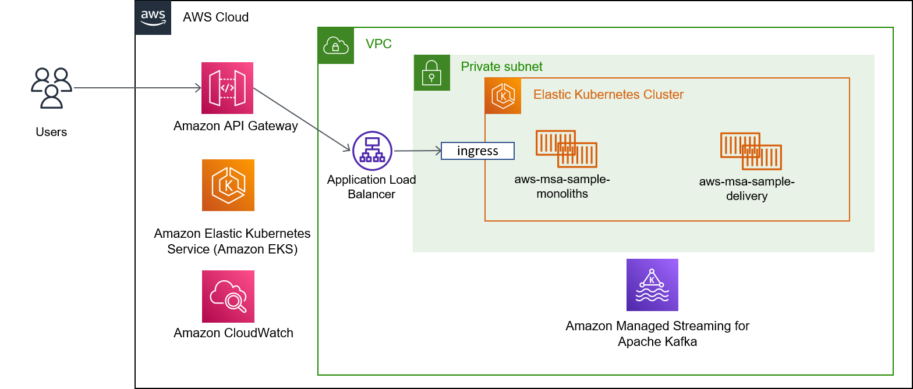

# aws-msa-monolith-sample
이 프로젝트는 엔터프라이즈 환경에서 AWS MSK 를 기반의 메시징 처리 예제 코드를 포함하고 있습니다. 

## 목표
- 마이크로서비스 간에 메시징에 대한 이해
- Dead Letter 처리 모니터링 및 관리 방안

## 어떤 기능을 제공하는 애플리케이션인가요?
|번호|기능|API|
|------|---|---|
|1|주문요청|POST /order|
|2|결제완료|POST /pay|
|3|배송조회|GET /shipment|
|4|배송시작|PUT /shipment|

## Cloud Architecture (AWS) 살펴보기

## Microservices Architecture 

## AWS EKS 환경에 배포하기
아래 가이드에 따라하면 AWS EKS 환경에서 배포에 배포 할 수 있습니다. 

- 01. EKS Cluster 생성
- 02. CI/CD 생성
- 03. 애플리케이션 배포하기

